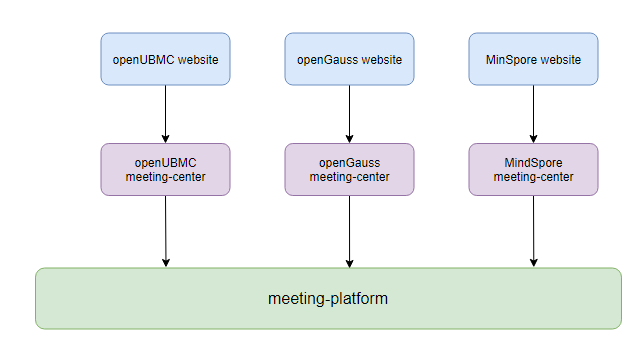

# meeting-center
### 1.What's here?

Provide meeting management capabilities for the official websites of various communities

### 2.Use Panorama

+ openUBMC, openGuass, and MindSpore all use one source code to run multiple services

### 3.How to use it

#### 1.Install 

~~~bash
yum install -y tzdata python3-devel mariadb-devel python3-pip gcc

pip3 install -r requirements.txt
~~~

#### 2.Config

+ Get the config and vault-config template from the [meeting-deploy](https://github.com/opensourceways/meeting-deploy/tree/main/meeting-center)
+ Replace environment variables with the correct configuration.

+ Set the environment variables for config and vault-config.

  ~~~bash
  export CONFIG_PATH=./config
  export VAULT_PATH=./vault-config
  ~~~

#### 3.Prepare

~~~bash
python3 manage.py migrate
~~~

#### 4.Test

+ Do test

  ~~~bash
  python3 manage.py test
  ~~~

  

+ View code test coverage

  ~~~bash
  python3 -m coverage run manage.py test
  coverage report
  ~~~

  

#### 5.Run

~~~bash
python3 manage.py runserver --noreload
~~~

### 4.Value-added features

1.sync sig info to db.

~~~bash
python3 manage.py sync_sig
~~~

